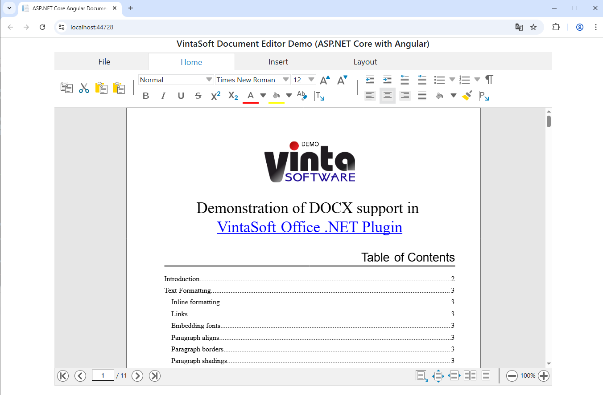

# VintaSoft ASP.NET Core Angular Document Editor Demo

This ASP.NET Core with Angular project uses <a href="https://www.vintasoft.com/vsimaging-dotnet-index.html">VintaSoft Imaging .NET SDK</a>.
The client-side of project is written on Angular (TypeScript+HTML+CSS). The server-side of project uses ASP.NET Core API controllers.

The project demonstrates how to edit new or existing DOCX document in ASP.NET Core with Angular:
* JavaScript UI control that works in all major HTML5 web browsers
* User interface is compatible with personal computers, tablets and smartphones
* Create new or load an existing DOCX document
* View and edit DOCX document:
* Add/change/delete text content in document
* Change text properties (font, font size, bold, italic, text color, ...) in a document
* Change paragraph properties (style, text alignment, text indent, list style, ...) in a document
* Insert/delete page break
* Add/edit/delete header or footer
* Change page settings
* Change settings of page columns
* Print DOCX document
* Download edited DOCX document or export DOCX document as PDF document
* "Standard" dialogs (text properties, paragraph properties, etc) for Bootstrap and JQuery UI
* User interface can be customized


## Screenshot
<br />


## Usage
1. Get the 30 day free evaluation license for <a href="https://www.vintasoft.com/vsimaging-dotnet-index.html" target="_blank">VintaSoft Imaging .NET SDK</a> as described here: <a href="https://www.vintasoft.com/docs/vsimaging-dotnet/Licensing-Evaluation.html" target="_blank">https://www.vintasoft.com/docs/vsimaging-dotnet/Licensing-Evaluation.html</a>

2. Update the evaluation license in "src\Program.cs" file:
   ```
   Vintasoft.Imaging.ImagingGlobalSettings.Register("REG_USER", "REG_EMAIL", "EXPIRATION_DATE", "REG_CODE");
   ```

3. Build the project ("AspNetCoreAngularDocumentEditorDemo.Net10.csproj" file) in Visual Studio or using .NET CLI:
   ```
   dotnet build AspNetCoreAngularDocumentEditorDemo.Net10.csproj
   ```

4. Run compiled application and try to view and annotate images and documents.


## Documentation
VintaSoft Imaging .NET SDK on-line User Guide and API Reference for Web developer is available here: https://www.vintasoft.com/docs/vsimaging-dotnet-web/


## Support
Please visit our <a href="https://myaccount.vintasoft.com/">online support center</a> if you have any question or problem.
